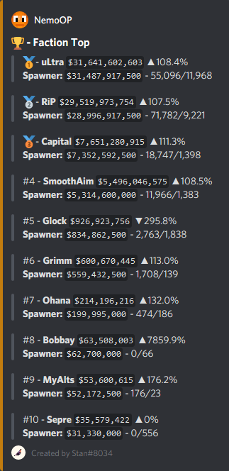
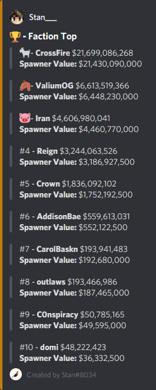
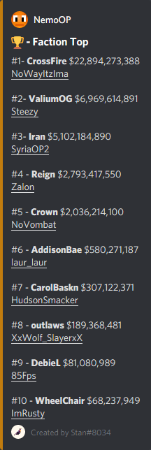

## What?
This is a script designed to display faction top information and hoverinfo specifically made for SaicoPvP Realms, I can not guarantee it works for any other servers.

## Why do I need this?
You're already afking tons of accounts on a realm that you are playing on, why not put them to work? Most mainstream ways players collect faction top information is either screenshotting every reboot and posting it in discord, or laboriously coding a discord bot from scratch that can only utilize one account at a time. This script is super lightweight and works for an unlimited number of accounts.

## Why should I trust you that this ain't a rat?
I admire your online security concerns, but, the code is open source and you can read through it to see what it does, along with comments to aid you along your way. I assure you this is safe.

## How do I use this?
Follow these steps and you will be well on your way

------------

##### 1. Download the files from the GitHub repo

##### 2. Place the files in the directory where you run MinecraftClient.exe from; i.e. working directory, the only files you need are the .cs and .ini files

##### 3. Make sure brandinfo is set to "vanilla" in MinecraftClient.ini, this ensures your account can send messages once inside the realm

	brandinfo=vanilla

##### 4. Make sure [ScriptScheduler] is enabled in MinecraftClient.ini

	[ScriptScheduler]
	enabled=true
	tasksfile=tasks.ini

##### 5. Add the following tasks to tasks.ini; if tasks.ini does not exist, create it

	[Task]
	triggerOnTime=true
	timeValue=
	script=factiontop.cs

	[Task]
	triggerOnTime=true
	timeValue=
	script=factiontop.cs

	[Task]
	triggerOnTime=true
	timeValue=
	script=factiontop.cs

##### 6. Make sure to set the reboot times correctly! I recommend setting the time to 15 minutes after a reboot. i.e. if reboot for your realm is at 16:45 make sure to set the time to 17:00. Time MUST be in 24hrs format

 	[Task]
	triggerOnTime=true
	timeValue=17:00
	script=factiontop.cs

##### 7. Create a Discord Webhook for your server. Server Settings > Webhooks > Create Webhook. Set the channel to the desired channel and copy the webhook url

##### 8. Enable and make sure your webhook url is set properly in factiontop.ini. Make sure there are no spaces before or after the equals sign

	[FactionTop]
	enabled=true
	webhook=PASTE_WEBHOOK_URL_HERE
	
##### 8.1 A proper factiontop.ini should look like this:

	[FactionTop]
	enabled=true
	webhook=https://discordapp.com/api/webhooks/...

## Advanced Settings
There are several advanced settings in the factiontop.ini file
##### Formatting
You are able to edit how the message is formatted in discord, you can use any discord supported markdown

	formatting=> {rank} - **{name}** `{value}` {change}\n> **Spawner:** `{spawners}` - {placed}/{stored}

An example would be, if you only wanted to display total and spawner values you could do

	formatting=> {rank} - **{name}** {value}\n> **Spawner Value:** {spawners}

Below is a list of all available variables and an example of what it would look like
| formatting code | example |
| ------ | ------ |
| {rank} | #1 |
| {name} | NemoOP |
| {leader} | defier_ |
| {value} |  $27,559,029,653 |
| {change} | ▲116.8% |
| {spawners} | $25,988,156,093 |
| {placed} | 74,386 |
| {stored} | 1,593 |
| {uuid} | 01424db3-9bfd-4d8d-bd87-299d409c5c24 |

##### Emojis
You are able to edit the emojis shown for first, second, and third place

	1=:first_place:
	2=:second_place:
	3=:third_place:
If you want to remove the emojis and use only the numbers, replace the emoji shortcodes with #1, #2, #3

Examples are below in the screenshots section

## Troubleshooting
###### I get an error that looks like this "System.InvalidOperationException"
The script was designed around build 275 of [Minecraft Console Client](https://github.com/ORelio/Minecraft-Console-Client), if you use an older version of MCC you may not have all the features that this script take advantage of. Download and run the latest version of MCC to fix this.

###### I set everything up correctly but my discord channel didnt get a message!
If your account isn't in a realm at the time you specified, it will not post faction top data in your discord. If you want to manually do so, enter the realm and type "/script factiontop.cs" and it will collect the data and post it to your discord webhook. Also, make sure your webhook is correctly pasted in the factiontop.ini file, refer to step [8.1](#81-a-proper-factiontopini-should-look-like-this) for an example of what it should look like.

###### Why am I getting multiple messages in my server every reboot?
The script has no way of knowing how many other scripts are also running and sending to the same discord channel. The advantage of this script is on some realms that are very full you will have a higher chance of getting at least one account online that will get faction top for you. If you have 12 accounts in the realm running this script, you might get 12 messages in discord after a reboot.

## Screenshots
  
